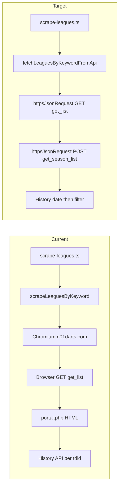

# Implementation Plan: API-Based League List for `scrapeLeaguesByKeyword`

## Executive Summary

Replace Chromium in `scrapeLeaguesByKeyword` with direct HTTP calls to the Nakka league APIs. The browser today only exists to open `n01darts.com` and then `fetch` the same Sakura endpoints (or scrape `portal.php` HTML that itself loads those endpoints).

Keep the public function name, the `{ leagues }` return shape, and the completed / last-6-months event filters. Do not add a Chromium fallback. Do not change match, player-results, tournament, or stats flows.

Verified league search (GET, no body):

```text
GET https://tk2-228-23746.vs.sakura.ne.jp/n01/league/n01_league.php?cmd=get_list&skip=0&count=30&keyword={encodeURIComponent(keyword)}
```

PowerShell that works:

```powershell
curl.exe --% "https://tk2-228-23746.vs.sakura.ne.jp/n01/league/n01_league.php?cmd=get_list&skip=0&count=30&keyword=Wtorkowe%20Granie"
```

Verified season/event list (POST, same transport style as tournaments):

```text
POST https://tk2-228-23746.vs.sakura.ne.jp/n01/league/n01_league.php?cmd=get_season_list&lgid={lgid}
Content-Type: application/json
Body: {"skip":0,"count":30,"keyword":"","status":[40],"sort":"date","sort_order":-1}
```

Event dates still come from the history API (`n01_history.php` first match `startTime`, minus 4 hours, UTC midnight), reused from `lib/nakka-api-tournaments.ts`. `t_date` on `get_season_list` is not always correct and must not replace that calculation.

A numeric body of `-50` / `{ "result": -50 }` means the API rejected the payload. Send the JSON string intact. Empty array `[]` is a valid “no matches” result.

---

## 1. Current Implementation

### 1.1 Entry points

- Handler: `api/scrape-leagues.ts`
- Function: `scrapeLeaguesByKeyword()` in `lib/nakka-scraper.ts`
- Output types: `NakkaLeagueScrapedDTO` / `NakkaLeagueEventScrapedDTO` in `lib/types.ts`

### 1.2 Current flow

1. Launch Playwright Chromium (`@sparticuz/chromium` on Vercel, local Chromium otherwise).
2. Open `https://n01darts.com` so `page.evaluate` can `fetch`.
3. `GET n01_league.php?cmd=get_list&skip=0&count=30&keyword=...` from inside the browser.
4. For each `lgid`, navigate to `portal.php?lgid=...` and scrape event cards from the DOM (`tdid`, `title`, `status_*` CSS class).
5. For each completed event (`status === 40`), call `scrapeTournamentDateFromResults`:
   - first `fetchTournamentDateFromHistoryApi` (already no browser)
   - Chromium HTML fallback if the API misses
6. Keep events with a parseable date and `date >= sixMonthsAgo`.
7. Return `{ leagues }` with nested `events`. Chromium memory errors retry up to twice.

### 1.3 Current output

```typescript
interface NakkaLeagueScrapedDTO {
  lgid: string;
  league_name: string;
  portal_href: string;
  events: NakkaLeagueEventScrapedDTO[];
}

interface NakkaLeagueEventScrapedDTO {
  event_id: string;
  event_name: string;
  event_href: string;
  league_id: string;
  event_status: string; // "completed"
  event_date: Date;
}
```

`portal_href` is `${NAKKA_LEAGUE_BASE_URL}/portal.php?lgid={lgid}`.  
`event_href` is `${NAKKA_LEAGUE_BASE_URL}/season.php?id={tdid}`.

### 1.4 Pain points

- High memory and cold-start cost on Vercel for JSON the site already loads from Sakura.
- `get_list` already works with a plain GET; Chromium is only a fetch proxy.
- Portal HTML scraping is redundant: `n01_league_portal.js` POSTs `cmd=get_season_list`.
- Chromium retries exist only because the browser runs out of memory.

### 1.5 What must stay

- `scrapeTournamentMatches` and `scrapeMatchPlayerResults` still use Chromium. Do not remove `@sparticuz/chromium` or Playwright from the repo.
- `fetchTournamentDateFromHistoryApi` / date math stay in `lib/nakka-api-tournaments.ts` and are reused for league events.
- Handler stays thin and keeps `{ success, data: { leagues }, stats }`.

---

## 2. Target Architecture



Follow the tournament pattern:

- New module: `lib/nakka-api-leagues.ts` (same role as `lib/nakka-api-tournaments.ts`)
- Transport: `httpsJsonRequest` from `lib/https-json.ts` (Node `https`, `agent: false`). Do not use `fetch` / undici.
- Handler stays thin.

---

## 3. Nakka Contracts

### 3.1 League `get_list`

| Item | Value |
|------|--------|
| Host | `https://tk2-228-23746.vs.sakura.ne.jp/n01/league/n01_league.php` |
| Method | GET |
| Query | `cmd=get_list&skip={n}&count=30&keyword={encodeURIComponent(keyword)}` |
| Body | none |

Keyword example: `Wtorkowe Granie` → `Wtorkowe%20Granie`.

Verified sample:

```json
[
  {
    "lgid": "lg_mD0F_0939",
    "title": "Wtorkowe Granie w Poznań Darts Club (Wrzesień)",
    "cnt": 5
  }
]
```

| Field | Type | Use |
|-------|------|-----|
| `lgid` | string | league id; required |
| `title` | string | `league_name`; fallback `"Unknown League"` |
| `cnt` | number | ignore (season count hint, not used) |

### 3.2 Season `get_season_list`

Discovered from `n01_league_portal.js` (`getList()`). Same item shape as tournament `get_list`.

| Item | Value |
|------|--------|
| Host | `https://tk2-228-23746.vs.sakura.ne.jp/n01/league/n01_league.php` |
| Method | POST |
| Query | `cmd=get_season_list&lgid={lgid}` |
| Content-Type | `application/json` |
| Body | `{"skip":0,"count":30,"keyword":"","status":[40],"sort":"date","sort_order":-1}` |

`status: 40` is `NAKKA_STATUS_CODES.COMPLETED`.

Verified sample for `lg_mD0F_0939`:

```json
[
  {
    "tdid": "t_pr8N_8121",
    "createTime": 1788357738,
    "title": "ZAKRĘCONA - Wtorkowe Granie w Poznań Darts Club Wrzesień #2",
    "t_date": 1788885000,
    "status": 40,
    "s": 218386,
    "d": 13925
  }
]
```

| Field | Type | Use |
|-------|------|-----|
| `tdid` | string | `event_id`; required |
| `title` | string | `event_name`; fallback `"Unknown Event"` |
| `status` | number | Must be `40` |
| `t_date` | number (unix seconds) | Ignore for `event_date` (not always correct) |
| `createTime` / `s` / `d` | number | Ignore |

### 3.3 Error body

If the parsed JSON is the number `-50`, `{ "result": -50 }`, or any non-array, throw. Empty array `[]` is valid.

### 3.4 DTO mapping

| DTO field | Source |
|-----------|--------|
| `lgid` | `item.lgid` |
| `league_name` | `item.title \|\| "Unknown League"` |
| `portal_href` | `` `${NAKKA_LEAGUE_BASE_URL}/portal.php?lgid=${lgid}` `` |
| `events[].event_id` | season `tdid` |
| `events[].event_name` | season `title \|\| "Unknown Event"` |
| `events[].event_href` | `` `${NAKKA_LEAGUE_BASE_URL}/season.php?id=${tdid}` `` |
| `events[].league_id` | parent `lgid` |
| `events[].event_status` | `"completed"` |
| `events[].event_date` | History API first match `startTime`, minus 4 hours, UTC midnight |

Keep leagues with no matching events (empty `events` array), same as today.

---

## 4. Pagination, Filtering, and Dates

### 4.1 Pagination

Current browser path requests one `get_list` page (`count=30`) and scrapes whatever the portal rendered.

Loop both list endpoints like tournaments:

1. `skip = 0`, `count = 30`
2. Request one page
3. Append the array
4. If `page.length < 30`, stop
5. Else `skip += 30` and repeat
6. Cap at 20 pages

Log skip/count per request.

### 4.2 Filters (unchanged league rules)

Keep a season when all of these are true:

- `item.tdid` is a non-empty string
- `item.status === Number(NAKKA_STATUS_CODES.COMPLETED)` (40)
- history `parsedDate` is non-null
- `parsedDate >= sixMonthsAgo` where `sixMonthsAgo` is `now` minus 6 months

Do not add the tournament-only `parsedDate < now` check. League scraping today does not drop future dates.

### 4.3 Date behavior

| | Current | Target |
|--|---------|--------|
| Source | History API first, then Chromium HTML | History API only via `fetchTournamentDateFromHistoryApi` |
| Adjustment | API path: `-4` hours, UTC midnight | Same |
| Missing date | Skip event | Skip event |

`t_date` from `get_season_list` is not used.

---

## 5. File-Level Modifications

### 5.1 `lib/constants.ts`

`NAKKA_LEAGUE_API_URL` and `NAKKA_LEAGUE_BASE_URL` already exist. No change.

### 5.2 New `lib/nakka-api-leagues.ts`

Mirror `lib/nakka-api-tournaments.ts`.

```typescript
export async function fetchLeaguesByKeywordFromApi(
  keyword: string
): Promise<{ leagues: NakkaLeagueScrapedDTO[] }>
```

Responsibilities:

1. Page loop against `GET cmd=get_list`
2. Reject non-array / `-50`
3. For each `lgid`, page loop against `POST cmd=get_season_list`
4. For each completed `tdid`, fetch history date
5. Map and filter to nested DTOs
6. Log requested URL, page size, and filtered counts

Export a thin alias:

```typescript
export async function scrapeLeaguesByKeyword(
  keyword: string
): Promise<{ leagues: NakkaLeagueScrapedDTO[] }> {
  return fetchLeaguesByKeywordFromApi(keyword);
}
```

Drop the `retryCount` argument. It existed only for Chromium OOM.

### 5.3 `lib/nakka-scraper.ts`

Replace the Chromium body of `scrapeLeaguesByKeyword` with a delegate:

```typescript
export { scrapeLeaguesByKeyword } from "./nakka-api-leagues.js";
```

Remove the league-only Chromium helpers that only existed for this flow:

- `fetchLeaguesByKeyword`
- `scrapeLeaguePortalForEvents`

Leave in this file:

- `scrapeTournamentMatches`
- `scrapeMatchPlayerResults`
- `scrapeTournamentStats`
- Playwright imports (still required by match flows)

Do not remove `@sparticuz/chromium` from the repo in this change.

### 5.4 `api/scrape-leagues.ts`

Keep CORS, optional `topdarter-api-key`, keyword validation, and `{ success, data, stats }`.

Change the import to the API module:

```typescript
import { scrapeLeaguesByKeyword } from "../lib/nakka-api-leagues.js";
```

No new request parameters. No feature flag.

### 5.5 `lib/https-json.ts`

No change. Caller validates array payloads.

### 5.6 `lib/types.ts`

No DTO change. Raw API types live in `lib/nakka-api-leagues.ts`.

### 5.7 Tests: `test/api-leagues.test.ts`

Unit-test mapping and filtering with the captured Wtorkowe Granie sample. Follow `test/api-tournaments.test.ts` style.

Cover:

- Map `lgid` / `title` / `portal_href`
- Fallback title `"Unknown League"`
- Map season `tdid` / `title` / history date / `event_href`
- Fallback event title `"Unknown Event"`
- Drop missing history date or missing `tdid`
- Drop `status !== 40`
- Drop `event_date < sixMonthsAgo`
- Keep a completed event inside the window
- Treat `-50` / `{ result: -50 }` as invalid
- Treat `[]` as valid empty

Do not require a live Sakura call in CI. Optional local/manual check: keyword `Wtorkowe Granie`.

### 5.8 Out of scope

- `scrapeTournamentMatches`
- `fetchMatchPlayerResultsFromApi` / calculations
- Tournament `get_list` (already API)
- Removing Playwright or `@sparticuz/chromium`
- Extra markdown besides this file

---

## 6. Suggested Implementation Order

1. Add `lib/nakka-api-leagues.ts` with list, season, map, and filter.
2. Point `scrapeLeaguesByKeyword` at the new function; update `api/scrape-leagues.ts` import.
3. Add `test/api-leagues.test.ts` using the Wtorkowe Granie sample.
4. Manual check: keyword `Wtorkowe Granie` returns leagues with completed events and history-based dates; empty/invalid keyword still 400 from the handler.

---

## 7. Verification Checklist

- [ ] `scrapeLeaguesByKeyword("Wtorkowe Granie")` does not launch Chromium
- [ ] League list URL uses `encodeURIComponent` (`Wtorkowe%20Granie`)
- [ ] League list is GET with no body
- [ ] Season list body is JSON with `status:[40]` and `Content-Type: application/json`
- [ ] Pages increment `skip` by 30 until a short page
- [ ] DTO fields match the table in section 3.4
- [ ] `portal_href` is `https://n01darts.com/n01/league/portal.php?lgid={lgid}`
- [ ] `event_href` is `https://n01darts.com/n01/league/season.php?id={tdid}`
- [ ] Dates older than 6 months are excluded
- [ ] `-50` throws; `[]` returns `[]` / empty events
- [ ] `api/scrape-leagues.ts` still returns `{ success, data: { leagues }, stats }`
- [ ] Match / player-results Chromium flows are unchanged
- [ ] Unit tests pass without network

---

## 8. Risks

### 8.1 History dates stay as they are

Dates still come from the first history match, minus 4 hours, at UTC midnight. `t_date` on `get_season_list` is ignored because it is not always correct.

### 8.2 GET vs POST

League search is GET. Season list is POST. Do not send a tournament-style body to `get_list`; the verified contract has no body.

### 8.3 Body / Content-Type sensitivity

A mangled JSON body on `get_season_list` returns `-50`. Node `JSON.stringify` plus `httpsJsonRequest` avoids PowerShell quote stripping.

### 8.4 Pagination vs old first-page request

The API path can return more than 30 leagues or seasons. That is more complete than the single browser page. The page cap is the safety limit.

### 8.5 Host stability

The host is the same Sakura box already used for player results and tournament `get_list`. If it moves, update `NAKKA_LEAGUE_API_URL` only.
