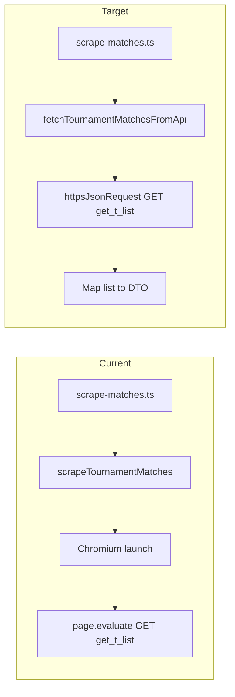

# Implementation Plan: API-Based Match List for `scrapeTournamentMatches`

## Executive Summary

Replace Chromium in `scrapeTournamentMatches` with a direct HTTP GET to the Nakka history API. The browser today only exists so `page.evaluate` can `fetch` the same Sakura endpoint.

Keep the public function name, the `NakkaMatchScrapedDTO[]` shape, href construction, and pagination (`count=100`, max 20 pages). Do not add a Chromium fallback. Do not change player-results, league, tournament-list, or stats flows.

Verified request (GET, no body):

```text
GET https://tk2-228-23746.vs.sakura.ne.jp/n01/tournament/n01_history.php?cmd=get_t_list&tdid={tdid}&skip=0&count=100&name=
```

PowerShell that works:

```powershell
curl.exe --% "https://tk2-228-23746.vs.sakura.ne.jp/n01/tournament/n01_history.php?cmd=get_t_list&tdid=t_Bhce_5464&skip=0&count=100&name="
```

`NAKKA_HISTORY_API_URL` already points at this host. Tournament/league date helpers already call it with `count=1`. This change uses the same endpoint with the existing match-list page size.

A numeric body of `-50` / `{ "result": -50 }` means the API rejected the payload. The success body is an object with a `list` array, not a top-level array. Empty `{ "list": [] }` is a valid “no matches” result.

---

## 1. Current Implementation

### 1.1 Entry points

- Handler: `api/scrape-matches.ts`
- Function: `scrapeTournamentMatches()` in `lib/nakka-scraper.ts`
- Output type: `NakkaMatchScrapedDTO` in `lib/types.ts`

### 1.2 Current flow

1. Parse `tournamentHref` for `id=` (`comp.php?id={tdid}`).
2. Launch Playwright Chromium (`@sparticuz/chromium` on Vercel, local Chromium otherwise).
3. From `page.evaluate`, `GET n01_history.php?cmd=get_t_list&tdid=...&skip=...&count=100&name=`.
4. Paginate while `list.length === 100`, cap at 20 pages (2000 matches).
5. Keep rows with `tmid`, `p1tpid`, and `p2tpid`.
6. Map `startTime` unix seconds to `new Date(startTime * 1000)` (no −4 hours, no UTC midnight).
7. Return the DTO array. Chromium memory errors retry up to twice.

### 1.3 Current output

```typescript
interface NakkaMatchScrapedDTO {
  nakka_match_identifier: string;
  match_type: string;
  first_player_name: string;
  first_player_code: string;
  second_player_name: string;
  second_player_code: string;
  href: string;
  match_date?: Date | null;
}
```

`href` is `https://n01darts.com/n01/tournament/n01_view.html?tmid={tmid}`.

`nakka_match_identifier` is the API `tmid` as-is. Do not sort player codes (that only happens in the unused `fetchMatchDatesFromHistoryApi` helper).

### 1.4 Pain points

- High memory and cold-start cost on Vercel for JSON the site already loads from Sakura.
- Chromium is only a fetch proxy; the curl above works without a browser.
- Chromium retries exist only because the browser runs out of memory.

### 1.5 What must stay

- `scrapeMatchPlayerResults` still uses Chromium. Do not remove `@sparticuz/chromium` or Playwright from the repo.
- `fetchTournamentDateFromHistoryApi` stays in `lib/nakka-api-tournaments.ts` (count=1, −4 hours, UTC midnight). Match `match_date` must not reuse that date math.
- Handler stays thin and keeps `{ success, data, count }`.

---

## 2. Target Architecture



Follow the league/tournament pattern:

- New module: `lib/nakka-api-matches.ts`
- Transport: `httpsJsonRequest` from `lib/https-json.ts` (Node `https`, `agent: false`). Do not use `fetch` / undici.
- Handler stays thin.

---

## 3. Nakka `get_t_list` Contract

### 3.1 Endpoint

| Item | Value |
|------|--------|
| Host | `https://tk2-228-23746.vs.sakura.ne.jp/n01/tournament/n01_history.php` |
| Method | GET |
| Query | `cmd=get_t_list&tdid={tdid}&skip={n}&count=100&name=` |
| Body | none |

`tdid` example: `t_Bhce_5464`. Always `encodeURIComponent` the id.

### 3.2 Response

Verified Agawa sample (`t_Bhce_5464`, first 3 rows):

```json
{
  "time": 1789325076883,
  "list": [
    {
      "tmid": "t_Bhce_5464_t_4_2F7T_Tal5",
      "startTime": 1772146718,
      "title": "Agawa 08 2026 Final",
      "endMatch": 1,
      "p1tpid": "2F7T",
      "p1name": "Krasnowski Mariusz",
      "p1country": "",
      "p2tpid": "Tal5",
      "p2name": "Kosicki Kamil",
      "p2country": "",
      "p1winLegs": 4,
      "p2winLegs": 1,
      "p1allScore": 2358,
      "p1allDarts": 99,
      "p2allScore": 2363,
      "p2allDarts": 95,
      "match_type": "01"
    }
  ]
}
```

| Field | Type | Use |
|-------|------|-----|
| `list` | array | required; match rows |
| `time` | number | ignore |
| `tmid` | string | `nakka_match_identifier`; required |
| `p1tpid` / `p2tpid` | string | player codes; required |
| `p1name` / `p2name` | string | player names; fallback `"Unknown"` |
| `title` | string | `match_type`; fallback `"unknown"` |
| `startTime` | number (unix seconds) | `match_date` via `new Date(startTime * 1000)` |
| `match_type` / scores / countries | — | ignore |

### 3.3 Error body

If the parsed JSON is the number `-50`, `{ "result": -50 }`, or an object without a `list` array, throw. `{ "list": [] }` is valid and maps to `[]`.

### 3.4 DTO mapping

| DTO field | Source |
|-----------|--------|
| `nakka_match_identifier` | `item.tmid` |
| `match_type` | `item.title \|\| "unknown"` |
| `first_player_name` | `item.p1name \|\| "Unknown"` |
| `first_player_code` | `item.p1tpid` |
| `second_player_name` | `item.p2name \|\| "Unknown"` |
| `second_player_code` | `item.p2tpid` |
| `href` | `` `${NAKKA_BASE_URL}/n01_view.html?tmid=${tmid}` `` |
| `match_date` | `startTime > 0 ? new Date(startTime * 1000) : null` |

Do not apply the tournament −4 hours / UTC midnight adjustment. Match timestamps stay wall-clock instants.

---

## 4. Pagination and Input

### 4.1 Tournament id

Keep the current extractor: first `[?&]id=([^&]+)` from `tournamentHref`.

Typical input: `https://n01darts.com/n01/tournament/comp.php?id=t_Bhce_5464`.

Throw if the id is missing. `encodeURIComponent` when building the history URL.

### 4.2 Pagination (unchanged)

1. `skip = 0`, `count = 100`
2. GET one page
3. Map and append `list`
4. If `list.length < 100`, stop
5. Else `skip += 100` and repeat
6. Cap at 20 pages

Log skip/count per request.

### 4.3 Filters (unchanged)

Keep a row when `tmid`, `p1tpid`, and `p2tpid` are all non-empty. Missing `startTime` is allowed (`match_date: null`).

---

## 5. File-Level Modifications

### 5.1 `lib/constants.ts`

`NAKKA_HISTORY_API_URL` and `NAKKA_BASE_URL` already exist. No change.

### 5.2 New `lib/nakka-api-matches.ts`

Mirror `lib/nakka-api-leagues.ts`.

```typescript
export async function fetchTournamentMatchesFromApi(
  tournamentHref: string
): Promise<NakkaMatchScrapedDTO[]>
```

Responsibilities:

1. Extract `tdid` from `tournamentHref`
2. Page loop against `GET cmd=get_t_list`
3. Reject missing/`-50` / non-array `list`
4. Map rows to `NakkaMatchScrapedDTO`
5. Log requested URL, page size, and mapped count

Export a thin alias:

```typescript
export async function scrapeTournamentMatches(
  tournamentHref: string
): Promise<NakkaMatchScrapedDTO[]> {
  return fetchTournamentMatchesFromApi(tournamentHref);
}
```

Drop the `retryCount` argument. It existed only for Chromium OOM.

### 5.3 `lib/nakka-scraper.ts`

Replace the Chromium body of `scrapeTournamentMatches` with a delegate:

```typescript
export { scrapeTournamentMatches } from "./nakka-api-matches.js";
```

Leave in this file:

- `scrapeMatchPlayerResults`
- `scrapeTournamentStats`
- Playwright imports (still required by player-results)

Do not remove `@sparticuz/chromium` from the repo in this change.

### 5.4 `api/scrape-matches.ts`

Keep CORS, optional `topdarter-api-key`, `tournamentHref` validation, and `{ success, data, count }`.

Change the import to the API module:

```typescript
import { scrapeTournamentMatches } from "../lib/nakka-api-matches.js";
```

No new request parameters. No feature flag.

### 5.5 `lib/https-json.ts`

No change. Caller validates `{ list: [...] }`.

### 5.6 `lib/types.ts`

No DTO change. Raw API types live in `lib/nakka-api-matches.ts`.

### 5.7 Tests: `test/api-matches.test.ts`

Unit-test mapping and payload checks with the captured Agawa sample. Follow `test/api-leagues.test.ts` style.

Cover:

- Extract `tdid` from `comp.php?id=`
- Throw when `id` is missing
- Accept `{ list: [...] }` and `{ list: [] }`
- Reject `-50` / `{ result: -50 }` / missing `list`
- Map `tmid` / names / codes / href / `startTime`
- Fallback `"Unknown"` names and `"unknown"` match type
- Drop missing `tmid` / `p1tpid` / `p2tpid`
- `match_date` is `null` when `startTime` is missing or `<= 0`

Do not require a live Sakura call in CI. Optional local/manual check: `tdid=t_Bhce_5464`.

### 5.8 Out of scope

- `scrapeMatchPlayerResults` / `fetchMatchPlayerResultsFromApi`
- League / tournament list APIs (already done)
- `scrapeTournamentStats`
- Removing Playwright or `@sparticuz/chromium`
- Extra markdown besides this file

---

## 6. Suggested Implementation Order

1. Add `lib/nakka-api-matches.ts` with id extract, page loop, map, and payload checks.
2. Point `scrapeTournamentMatches` at the new function; update `api/scrape-matches.ts` import.
3. Add `test/api-matches.test.ts` using the Agawa sample.
4. Manual check: href `comp.php?id=t_Bhce_5464` returns matches with `tmid` identifiers and `n01_view.html` hrefs; missing href still 400 from the handler.

---

## 7. Verification Checklist

- [ ] `scrapeTournamentMatches(comp.php?id=t_Bhce_5464)` does not launch Chromium
- [ ] History URL uses `encodeURIComponent` on `tdid`
- [ ] Request is GET with no body, `count=100`
- [ ] Pages increment `skip` by 100 until a short page
- [ ] DTO fields match the table in section 3.4
- [ ] `href` is `https://n01darts.com/n01/tournament/n01_view.html?tmid={tmid}`
- [ ] `match_date` is raw `startTime * 1000`, not the tournament −4h midnight date
- [ ] `-50` throws; `{ list: [] }` returns `[]`
- [ ] `api/scrape-matches.ts` still returns `{ success, data, count }`
- [ ] Player-results Chromium flow is unchanged
- [ ] Unit tests pass without network

---

## 8. Risks

### 8.1 Match dates stay as they are

`match_date` stays `new Date(startTime * 1000)`. Do not reuse `parseTournamentDateFromHistoryStartTime`. That helper exists for tournament/league calendar days, not individual match instants.

### 8.2 Response shape is an object

Unlike league/tournament `get_list`, history returns `{ time, list }`. Validating `Array.isArray(data)` would reject every success body.

### 8.3 GET vs POST

This endpoint is GET. Do not send a JSON body.

### 8.4 Pagination vs a single curl

A busy tournament can have more than 100 matches. The page cap (20 × 100) is the same safety limit as the Chromium path.

### 8.5 Host stability

The host is the same Sakura box already used for tournament dates. If it moves, update `NAKKA_HISTORY_API_URL` only.
