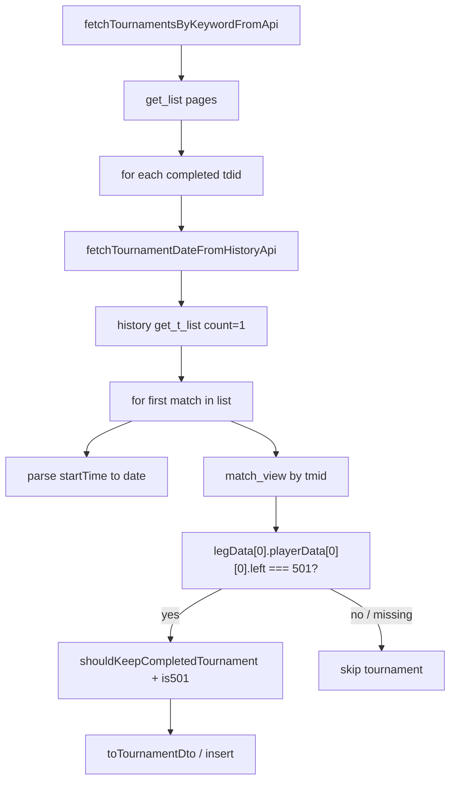

# Implementation Plan: Only 501 Tournaments for Stats

## Executive Summary

Add one extra keep/skip condition to the current tournament-list algorithm so **only 501 (x01) tournaments** are inserted. Cricket, 301, 701, and other start scores must not reach stats.

The probe happens in `fetchTournamentDateFromHistoryApi`, inside the existing `for` over history matches. History already requests `count=1` (first match only). For that first match, call the same `match_view` API used by `fetchMatchPlayerResultsFromApi`. Read **first leg, first player, first dart** `left`. If `left === 501`, keep the tournament. Otherwise skip it.

Do not change DTO shapes, pagination, date math (−4 hours, UTC midnight), or completed / last-6-months filters. Do not scan later matches looking for a 501 game. Do not compute player stats for this check.

Verified history request (already used, `count=1`):

```text
GET https://tk2-228-23746.vs.sakura.ne.jp/n01/tournament/n01_history.php?cmd=get_t_list&tdid={tdid}&skip=0&count=1&name=
```

Verified match-view request (same as player-results):

```text
POST https://tk2-228-23746.vs.sakura.ne.jp/n01/tournament/n01_user_t.php?cmd=match_view&sid=
Content-Type: application/x-www-form-urlencoded; charset=UTF-8
Body: {"tmid":"{tmid}"}
```

PowerShell that works:

```powershell
curl.exe --% "https://tk2-228-23746.vs.sakura.ne.jp/n01/tournament/n01_user_t.php?cmd=match_view&sid=" -H "Content-Type: application/x-www-form-urlencoded; charset=UTF-8" --data-raw "{\"tmid\":\"t_Bhce_5464_rr_0_2F7T_XOGp\"}"
```

---

## 1. Current Implementation

### 1.1 Entry points

- Handler: `api/scrape-tournaments.ts`
- List: `fetchTournamentsByKeywordFromApi()` in `lib/nakka-api-tournaments.ts`
- Date probe: `fetchTournamentDateFromHistoryApi()` in `lib/nakka-api-tournaments.ts`
- Keep rule: `shouldKeepCompletedTournament()` in `lib/nakka-api-tournaments.ts`
- Stats (downstream): `fetchTournamentStatsFromApi()` in `lib/nakka-api-stats.ts` — unchanged; it only runs for tournaments that were inserted

### 1.2 Current keep algorithm

For each `get_list` row:

1. Skip if missing `tdid` or `status !== 40`.
2. `parsedDate = await fetchTournamentDateFromHistoryApi(item.tdid)`.
3. Keep if `shouldKeepCompletedTournament(item, parsedDate, now, sixMonthsAgo)`:
   - `tdid` present
   - `status === 40`
   - `parsedDate` non-null
   - `parsedDate < now`
   - `parsedDate >= sixMonthsAgo`
4. Map with `toTournamentDto` and push.

`fetchTournamentDateFromHistoryApi` today:

1. GET history `cmd=get_t_list` with `count=1`.
2. Type: `NakkaHistoryListResponse` with `list?: Array<{ startTime?: number }>`.
3. Loop matches; on first valid `startTime`, parse date (−4 hours, UTC midnight) and return it.
4. No `tmid`, no `match_view`, no start-score check.

### 1.3 Why history `match_type` / `startScore` are not enough

History rows include `"match_type": "01"` for x01 games. That does not distinguish 301 vs 501 vs 701. The match-view body also has `startScore`, but this change must follow the explicit rule: **first dart remaining score** (`left`) on the first player of the first leg of the first match.

Opening visit for 501:

```json
{ "score": 0, "left": 501 }
```

301 would be `"left": 301`. Missing / empty `legData` cannot be treated as 501.

### 1.4 What must stay

- `count=1` on the history date probe (first match only).
- Date math in `parseTournamentDateFromHistoryStartTime`.
- Existing completed / 6-month / past-date filters.
- Public `NakkaTournamentScrapedDTO`.
- `fetchMatchPlayerResultsFromApi` behavior for the player-results endpoint (stats calculations stay as they are).
- Match-list module (`lib/nakka-api-matches.ts`) pagination and DTO mapping.

---

## 2. Target Architecture



One extra HTTP call per tournament: history (already there) + one `match_view` for `list[0].tmid`. Stop after the first history row. Do not paginate matches. Do not walk later legs or the second player.

---

## 3. Nakka Contracts Used

### 3.1 History list item (extend local type)

`NakkaHistoryListResponse` in `lib/nakka-api-tournaments.ts` today only has `startTime`. Add `tmid`. Other fields exist on the wire and may be typed optionally; they are not required for this check.

```typescript
interface NakkaHistoryListResponse {
  list?: Array<{
    tmid?: string;
    startTime?: number;
  }>;
}
```

Verified sample row:

```json
{
  "tmid": "t_Bhce_5464_rr_0_2F7T_XOGp",
  "startTime": 1772132718,
  "title": "Agawa 08 2026 Group 1",
  "endMatch": 1,
  "p1tpid": "2F7T",
  "p1name": "Krasnowski Mariusz",
  "p2tpid": "XOGp",
  "p2name": "Woźniak Stanisław",
  "p1winLegs": 3,
  "p2winLegs": 2,
  "p1allScore": 2242,
  "p1allDarts": 109,
  "p2allScore": 2271,
  "p2allDarts": 107,
  "match_type": "01"
}
```

Do not use `match_type === "01"` as the keep rule.

The match-list module already has a fuller `NakkaHistoryListResponse` / `NakkaApiMatchHistoryItem` with `tmid`. Do not merge those types in this change unless it is a trivial import. Keep the tournament-local type minimal.

### 3.2 Match view

Same endpoint and body as `fetchMatchPlayerResultsFromApi`:

| Item | Value |
|------|--------|
| Host | `https://tk2-228-23746.vs.sakura.ne.jp/n01/tournament/n01_user_t.php` |
| Query | `cmd=match_view&sid=` |
| Method | POST |
| Content-Type | `application/x-www-form-urlencoded; charset=UTF-8` |
| Body | `JSON.stringify({ tmid })` |

Path to inspect (O(1), no loops over legs/visits):

```text
legData[0].playerData[0][0].left === 501
```

| Index | Meaning |
|-------|---------|
| `legData[0]` | first leg |
| `playerData[0]` | first player |
| `[0]` | opening dart row (`score: 0`, remaining start) |
| `.left` | starting remaining score |

Keep when that value is exactly `501`. Skip when it is missing, not a number, or any other value (301, 701, cricket, empty array).

`startScore` on the match body is informational only. Do not substitute it for `left`.

---

## 4. Algorithm Change

### 4.1 New condition (additive)

Keep a tournament when **all** of the current rules are true **and**:

- the first history match has a `tmid`
- `match_view` returns `legData[0].playerData[0][0].left === 501`

This is a new argument/flag on the existing keep helper, not a replacement of date or status checks.

### 4.2 `fetchTournamentDateFromHistoryApi` for-loop

Keep the existing `for (const match of data.list)` (history is already `count=1`). Inside that loop, after the current `startTime` date parse:

1. If `match.tmid` is missing: treat as not 501, stop (do not look at later rows).
2. POST `match_view` with `{ tmid: match.tmid }` using the same transport as player-results (`httpsJsonRequest`, not `fetch`).
3. Run the O(1) `left === 501` helper on the body.
4. Return both the parsed date (existing behavior) and the 501 flag.
5. **Return after the first list item.** Do not continue the loop to find another match that happens to be 501.

Suggested return shape (avoids conflating “no date” with “not 501” in logs):

```typescript
export interface TournamentHistoryProbe {
  parsedDate: Date | null;
  is501: boolean;
}
```

Caller:

```typescript
const probe = await fetchTournamentDateFromHistoryApi(item.tdid);
if (
  shouldKeepCompletedTournament(item, probe.parsedDate, now, sixMonthsAgo, probe.is501) &&
  probe.parsedDate
) {
  tournaments.push(toTournamentDto(item, probe.parsedDate));
}
```

`shouldKeepCompletedTournament` gains `is501: boolean` and requires it to be `true`.

Skip / log cases:

| Situation | `parsedDate` | `is501` | Result |
|-----------|--------------|---------|--------|
| Valid date, `left === 501` | Date | true | Keep if other filters pass |
| Valid date, `left === 301` (or other) | Date | false | Skip |
| Valid date, missing `tmid` / `legData` / `playerData` | Date | false | Skip |
| No valid `startTime` | null | false (or unused) | Skip (existing) |
| History or `match_view` throws | null / false | false | Skip (same as today’s history catch) |

Do not throw out of the date probe for a non-501 match. Skip is the product behavior.

### 4.3 Efficiency rules

- History `count=1` stays. One match identifier per tournament.
- One `match_view` per tournament, only for that `tmid`.
- Read only `legData[0].playerData[0][0].left`. No `for` over `legData`, no second player, no stats math.
- Do not call `fetchMatchPlayerResultsFromApi(tmid, p1, p2)` for this probe. That function requires both player codes, validates `statsData`, and computes averages / checkouts / score bands. Too heavy and it throws on incomplete bodies.
- Reuse its **request** (URL, POST, `urlencoded`, `{ tmid }`). Preferred: extract a small `fetchMatchViewFromApi(tmid)` (or equivalent) that returns the raw match JSON; player-results can keep using the current function unchanged, or later switch to the shared fetch.
- Optional: add `NAKKA_MATCH_VIEW_API_URL` in `lib/constants.ts` and point both call sites at it. If player-results is left as-is, duplicate the URL string only in the tournament module for this change — prefer the constant.

### 4.4 Lightweight 501 helper

Pure function, unit-tested, no network:

```typescript
export const NAKKA_START_SCORE_501 = 501;

export function is501FromFirstLegFirstPlayer(match: {
  legData?: Array<{
    playerData?: Array<Array<{ left?: number }>>;
  }>;
} | null | undefined): boolean {
  const left = match?.legData?.[0]?.playerData?.[0]?.[0]?.left;
  return left === NAKKA_START_SCORE_501;
}
```

Optional types from `NakkaApiMatchResponse` / `NakkaLegData` in `lib/nakka-api-calculations.ts` may be used instead of an inline shape.

Network wrapper used only from the history for-loop:

```typescript
async function fetchFirstMatchIs501(tmid: string): Promise<boolean> {
  try {
    const apiData = await fetchMatchViewFromApi(tmid); // same POST as player-results
    return is501FromFirstLegFirstPlayer(apiData);
  } catch {
    return false;
  }
}
```

---

## 5. File-Level Modifications

### 5.1 `lib/nakka-api-tournaments.ts` (primary)

- Extend `NakkaHistoryListResponse.list` with `tmid?: string`.
- Change `fetchTournamentDateFromHistoryApi` to probe 501 inside the existing `for`.
- Add `is501` to `shouldKeepCompletedTournament`.
- Introduce `TournamentHistoryProbe` (or equivalent) so the caller can apply the new condition without losing skip-reason logs.
- Log: date scraped (existing) and `501 keep/skip` with `tdid`, `tmid`, and observed `left` when cheap to log.

### 5.2 `lib/constants.ts`

Add (recommended):

```typescript
export const NAKKA_MATCH_VIEW_API_URL =
  "https://tk2-228-23746.vs.sakura.ne.jp/n01/tournament/n01_user_t.php?cmd=match_view&sid=";
export const NAKKA_START_SCORE_501 = 501;
```

### 5.3 Shared match-view fetch (small)

Either:

- New helper next to player-results, e.g. `fetchMatchViewFromApi(tmid)` in `lib/nakka-api-player-results.ts` (or a tiny `lib/nakka-api-match-view.ts`), **or**
- Inline the POST only in the tournament module if extracting would widen the player-results diff.

Do **not** change the public signature or calculations of `fetchMatchPlayerResultsFromApi` unless the shared fetch is a mechanical extract.

### 5.4 `lib/nakka-api-stats.ts` / `api/scrape-tournament-stats.ts`

No change. Filtering at insert time is what keeps non-501 tournaments out of stats.

### 5.5 `lib/types.ts`

No DTO change.

### 5.6 Tests: `test/api-tournaments.test.ts`

Extend existing mapping/filter tests. No live Sakura calls in CI.

Cover:

- `is501FromFirstLegFirstPlayer`: `left: 501` → true
- `left: 301` → false
- `left: 701` → false
- missing `legData` / empty `playerData` / missing first dart → false
- `shouldKeepCompletedTournament(..., is501: false)` → false even when date/status would keep
- `shouldKeepCompletedTournament(..., is501: true)` still respects status, `tdid`, date window
- History type accepts `tmid` on list items

Fixture for the keep path can be a minimal slice of the provided match-view body:

```json
{
  "legData": [
    {
      "playerData": [
        [{ "score": 0, "left": 501 }]
      ]
    }
  ]
}
```

### 5.7 Out of scope

- Changing how stats are calculated
- Filtering inside `fetchTournamentStatsFromApi`
- Scanning every match in a tournament
- Using `match_type`, `startScore`, or tournament title as the 501 rule
- Chromium / Playwright
- Match-list pagination (`count=100`)
- League event scraping, unless it reuses `fetchTournamentDateFromHistoryApi` and a signature change requires a compile fix — if leagues import that function, update the call to the probe type or keep a thin date-only wrapper so leagues are unchanged

**League check:** confirm whether `fetchTournamentDateFromHistoryApi` is imported outside `nakka-api-tournaments.ts`. If yes, either keep a date-only wrapper or update that one caller. Do not silently apply the 501 skip to leagues unless product wants the same rule there. Default for this plan: **501 filter is for tournament-list insert only.**

---

## 6. Suggested Implementation Order

1. Add `is501FromFirstLegFirstPlayer` + unit tests (no network).
2. Extend `NakkaHistoryListResponse` with `tmid`.
3. Add match-view POST helper (shared or local) using `httpsJsonRequest`.
4. Inside `fetchTournamentDateFromHistoryApi`’s `for`, probe first match `tmid` and return `{ parsedDate, is501 }`.
5. Add `is501` to `shouldKeepCompletedTournament` and the insert loop.
6. Log skip vs keep for 501.
7. Confirm leagues / other callers of the date function still compile.
8. Run `test/api-tournaments.test.ts`.

---

## 7. Verification Checklist

- [ ] History request is still `count=1` (first match only)
- [ ] `match_view` is called at most once per tournament, with that match’s `tmid`
- [ ] Only `legData[0].playerData[0][0].left` is read for the keep decision
- [ ] `left === 501` → eligible for insert (subject to existing date/status filters)
- [ ] `left !== 501` or missing path → tournament not inserted
- [ ] `fetchMatchPlayerResultsFromApi` is not used for the probe (too heavy)
- [ ] Date math (−4 hours, UTC midnight) unchanged
- [ ] 6-month / completed / past-date filters unchanged
- [ ] Stats API module unchanged
- [ ] Unit tests pass without network
- [ ] Manual (optional): keyword that includes mixed formats; 501 events appear, 301/cricket do not

---

## 8. Risks

### 8.1 Extra latency

Every completed tournament already pays one history GET. This adds one `match_view` POST per tournament. Accepted: required to distinguish 501 from other x01. Cap is still the existing page cap (`TOURNAMENT_LIST_MAX_PAGES`).

### 8.2 Incomplete first match

If the first history match has no `legData` yet, the tournament is skipped. Do not fall back to later matches (would violate “first match only” and could mis-classify a mixed event).

### 8.3 `fetchMatchPlayerResultsFromApi` misuse

Calling it would need `p1tpid` / `p2tpid` from history, throw on missing `statsData`, and compute full stats. That is slower and can skip valid 501 matches that still have `left: 501` on the first dart. Use the raw match-view body only.

### 8.4 Signature change of the date probe

If league code calls `fetchTournamentDateFromHistoryApi` and expects `Date | null`, update that caller or split `fetchTournamentHistoryProbe` vs a date-only alias. Default: 501 skip applies only to tournament-list insert.

### 8.5 `httpsJsonRequest` and failed match-view

Treat parse errors, non-2xx, and missing `legData` as `is501: false`. Do not fail the whole keyword scrape.

---

## 9. Explicit Non-Goals

- Do not filter by tournament title starting with `"501"`.
- Do not keep a tournament because a later match is 501.
- Do not iterate all legs “to be sure”.
- Do not implement the 501 check inside the stats scraper in this change.
