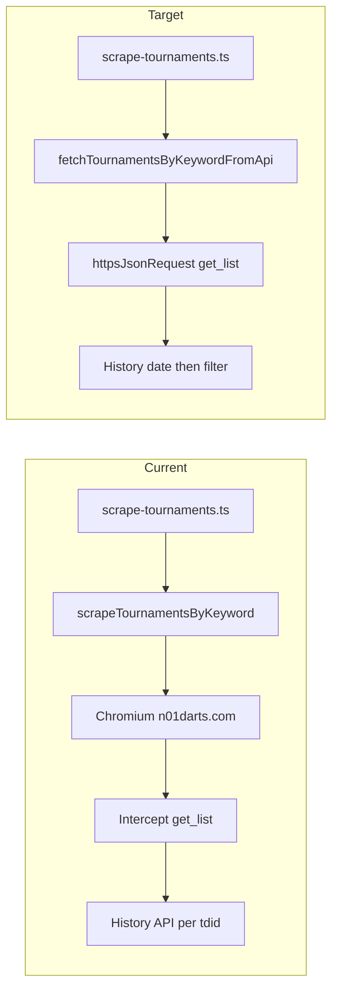

# Implementation Plan: API-Based Tournament List for `scrapeTournamentsByKeyword`

## Executive Summary

Replace Chromium in `scrapeTournamentsByKeyword` with a direct HTTP POST to the Nakka tournament `get_list` API. The browser today only exists to open `n01darts.com` and intercept the same Sakura endpoint. Tournament dates still come from the history API (`n01_history.php` first match `startTime`, minus 4 hours, UTC midnight). `t_date` on `get_list` is not always correct and must not replace that calculation.

Keep the public function name, the `NakkaTournamentScrapedDTO` shape, and the completed / last-6-months / past-date filters. Do not add a Chromium fallback. Do not change match, player-results, league, or stats flows.

Verified request:

```text
POST https://tk2-228-23746.vs.sakura.ne.jp/n01/tournament/n01_tournament.php?cmd=get_list&skip=0&count=30&keyword={encodeURIComponent(keyword)}
Content-Type: application/json
Body: {"status":[40],"sort":"active"}
```

PowerShell that works:

```powershell
curl.exe --% "https://tk2-228-23746.vs.sakura.ne.jp/n01/tournament/n01_tournament.php?cmd=get_list&skip=0&count=30&keyword=pozna%C5%84" --data-raw "{\"status\":[40],\"sort\":\"active\"}"
```

A numeric body of `-50` means the API rejected the payload (wrong or mangled JSON). Send the JSON string intact.

---

## 1. Current Implementation

### 1.1 Entry points

- Handler: `api/scrape-tournaments.ts`
- Function: `scrapeTournamentsByKeyword()` in `lib/nakka-scraper.ts` (line 402)
- Output type: `NakkaTournamentScrapedDTO` in `lib/types.ts`

### 1.2 Current flow

1. Launch Playwright Chromium (`@sparticuz/chromium` on Vercel, local Chromium otherwise).
2. Open `${NAKKA_BASE_URL}/?keyword=${encodeURIComponent(keyword)}` (`https://n01darts.com/n01/tournament`).
3. Intercept responses whose URL contains `n01_tournament.php` and `cmd=get_list`.
4. Ignore `t_date` (the conversion is commented out).
5. For each completed row (`status === 40`), call `scrapeTournamentDateFromResults`:
   - browser `fetch` to `n01_history.php?cmd=get_t_list`
   - subtract 4 hours from the first match `startTime`
   - strip time to UTC midnight
6. Keep rows with `tdid`, `status === 40`, a parseable date, `date < now`, and `date >= sixMonthsAgo`.
7. Map to DTO and return. Chromium memory errors retry up to twice.

### 1.3 Current output

```typescript
interface NakkaTournamentScrapedDTO {
  nakka_identifier: string;
  tournament_name: string;
  href: string;
  tournament_date: Date;
  status: string; // "completed"
}
```

`href` is `${NAKKA_BASE_URL}/comp.php?id=${tdid}`.

### 1.4 Pain points

- High memory and cold-start cost on Vercel for a JSON list the site already loads from Sakura.
- Fragile intercept: if the page request finishes before `get_list`, the function returns `[]`.
- One history request per tournament for the date (kept: `t_date` is not always correct).
- Chromium retries exist only because the browser runs out of memory.

### 1.5 What must stay

`scrapeTournamentDateFromResults` is also used by league event scraping around line 1520 of `lib/nakka-scraper.ts`. Do not delete it. Only stop calling it from `scrapeTournamentsByKeyword`.

---

## 2. Target Architecture



Follow the player-results pattern:

- New module: `lib/nakka-api-tournaments.ts` (same role as `lib/nakka-api-player-results.ts`)
- Transport: `httpsJsonRequest` from `lib/https-json.ts` (Node `https`, `agent: false`). Do not use `fetch` / undici.
- Handler stays thin and keeps `{ success, data, count }`.

---

## 3. Nakka `get_list` Contract

### 3.1 Endpoint

| Item | Value |
|------|--------|
| Host | `https://tk2-228-23746.vs.sakura.ne.jp/n01/tournament/n01_tournament.php` |
| Method | POST |
| Query | `cmd=get_list&skip={n}&count=30&keyword={encodeURIComponent(keyword)}` |
| Content-Type | `application/json` |
| Body | `{"status":[40],"sort":"active"}` |

`status: 40` is `NAKKA_STATUS_CODES.COMPLETED`. Keyword example: `poznań` → `pozna%C5%84`.

### 3.2 Response item

Verified Poznań sample fields:

| Field | Type | Use |
|-------|------|-----|
| `tdid` | string | `nakka_identifier`; required |
| `title` | string | `tournament_name`; fallback `"Unknown Tournament"` |
| `t_date` | number (unix seconds) | Ignore for `tournament_date` (not always correct) |
| `status` | number | Must be `40` |
| `createTime` | number | Ignore |
| `s` | number | Ignore |
| `d` | number | Ignore |

Example row:

```json
{
  "tdid": "t_ZA3r_2927",
  "createTime": 1788769922,
  "title": "23. turniej DART:START (śr. <45) w Poznań Darts Club",
  "t_date": 1789221600,
  "status": 40,
  "s": 88794,
  "d": 6643
}
```

The captured first page has 30 items, all `status: 40`, all with a positive `t_date`.

### 3.3 Error body

If the parsed JSON is the number `-50` (or a non-array), throw. That is the API’s invalid-request signal, not an empty list. Empty array `[]` is a valid “no matches” result.

`httpsJsonRequest` currently `JSON.parse`s any 2xx body. After the call, validate:

```typescript
if (!Array.isArray(data)) {
  throw new Error(`Tournament list API returned invalid payload: ${JSON.stringify(data)}`);
}
```

### 3.4 DTO mapping

| DTO field | Source |
|-----------|--------|
| `nakka_identifier` | `item.tdid` |
| `tournament_name` | `item.title \|\| "Unknown Tournament"` |
| `href` | `` `${NAKKA_BASE_URL}/comp.php?id=${item.tdid}` `` |
| `tournament_date` | History API first match `startTime`, minus 4 hours, UTC midnight |
| `status` | `"completed"` |

Keep the existing history date calculation. Do not use `t_date`. Skip rows with missing `tdid` or no history date.

---

## 4. Pagination, Filtering, and Dates

### 4.1 Pagination

The browser intercept typically captured one page (`count=30`). That can miss older completed tournaments still inside the 6-month window.

Loop:

1. `skip = 0`, `count = 30`, `allItems = []`
2. POST one page
3. Append the array
4. If `page.length < 30`, stop
5. Else `skip += 30` and repeat

Then run the existing client-side filter on the combined list.

Guardrail: cap pages (for example 20 pages / 600 rows) so a bad keyword cannot loop forever. Log skip/count per request.

### 4.2 Filters (unchanged rules)

Keep an item when all of these are true:

- `item.tdid` is a non-empty string
- `item.status === Number(NAKKA_STATUS_CODES.COMPLETED)` (40), even though the request already asks for `[40]`
- history `parsedDate` is non-null
- `parsedDate < now`
- `parsedDate >= sixMonthsAgo` where `sixMonthsAgo` is `now` minus 6 months

### 4.3 Date behavior (unchanged)

| | Current | Target |
|--|---------|--------|
| Source | First match `startTime` from history API | Same history API via `httpsJsonRequest` |
| Adjustment | `-4` hours, then UTC midnight | Same |
| Missing date | Skip tournament | Skip tournament |

`t_date` from `get_list` is not used. Not every tournament has a correct `t_date`; history is the source of truth.

---

## 5. File-Level Modifications

### 5.1 `lib/constants.ts`

Add:

```typescript
export const NAKKA_TOURNAMENT_API_URL =
  "https://tk2-228-23746.vs.sakura.ne.jp/n01/tournament/n01_tournament.php";
export const NAKKA_HISTORY_API_URL =
  "https://tk2-228-23746.vs.sakura.ne.jp/n01/tournament/n01_history.php";
```

`NAKKA_BASE_URL` stays the href prefix. `NAKKA_STATUS_CODES.COMPLETED` stays `40`.

### 5.2 New `lib/nakka-api-tournaments.ts`

Mirror `lib/nakka-api-player-results.ts`.

```typescript
export interface NakkaApiTournamentListItem {
  tdid: string;
  title: string;
  status: number;
  t_date: number;
  createTime?: number;
  s?: number;
  d?: number;
}

export async function fetchTournamentsByKeywordFromApi(
  keyword: string
): Promise<NakkaTournamentScrapedDTO[]>
```

Responsibilities:

1. Trim/validate keyword (caller already checks string; still `encodeURIComponent`)
2. Page loop against `NAKKA_TOURNAMENT_API_URL`
3. `httpsJsonRequest<NakkaApiTournamentListItem[]>` with:
   - `method: "POST"`
   - `headers: { "Content-Type": "application/json" }`
   - `body: JSON.stringify({ status: [NAKKA_STATUS_CODES.COMPLETED], sort: "active" })`
4. Reject non-array / `-50`
5. For each completed `tdid`, fetch history date (`fetchTournamentDateFromHistoryApi`)
6. Map and filter to `NakkaTournamentScrapedDTO[]`
7. Log requested URL, page size, and filtered count

Export a thin alias if useful:

```typescript
export async function scrapeTournamentsByKeyword(
  keyword: string
): Promise<NakkaTournamentScrapedDTO[]> {
  return fetchTournamentsByKeywordFromApi(keyword);
}
```

Drop the `retryCount` argument. It existed only for Chromium OOM.

### 5.3 `lib/nakka-scraper.ts`

Replace the Chromium body of `scrapeTournamentsByKeyword` with a delegate:

```typescript
export { scrapeTournamentsByKeyword } from "./nakka-api-tournaments.js";
```

or a one-line wrapper that calls `fetchTournamentsByKeywordFromApi`.

Leave in this file:

- `scrapeTournamentDateFromResults`
- `scrapeTournamentMatches`
- league / stats Chromium flows
- Playwright imports (still required by those flows)

Do not remove `@sparticuz/chromium` from the repo in this change.

### 5.4 `api/scrape-tournaments.ts`

Keep CORS, optional `topdarter-api-key`, keyword validation, and `{ success, data, count }`.

Change the import to the API module (same pattern as `api/scrape-player-results.ts` → `fetchMatchPlayerResultsFromApi`):

```typescript
import { scrapeTournamentsByKeyword } from "../lib/nakka-api-tournaments.js";
```

No new request parameters. No feature flag.

### 5.5 `lib/https-json.ts`

No change unless `-50` handling is cleaner as a typed check in the caller (preferred: caller validates array).

### 5.6 `lib/types.ts`

No DTO change. Raw API types live in `lib/nakka-api-tournaments.ts` (or a small local interface there), not in the public DTO file.

### 5.7 Tests: `test/api-tournaments.test.ts`

Unit-test mapping and filtering with the captured Poznań page (30 rows, all `status: 40`, all have `t_date`). Follow `test/api-calculations.test.ts` style.

Cover:

- Map `tdid` / `title` / history date / href correctly
- Fallback title `"Unknown Tournament"`
- Drop missing history date or missing `tdid`
- Drop `status !== 40`
- Drop `tournament_date >= now`
- Drop `tournament_date < sixMonthsAgo`
- Keep a row inside the window
- Treat a numeric `-50` payload as invalid (helper or wrapper)

Do not require a live Sakura call in CI. Optional local/manual check: keyword `poznań`.

### 5.8 Out of scope

- `scrapeTournamentMatches`
- `fetchMatchPlayerResultsFromApi` / calculations
- League portal Chromium
- Removing Playwright or `@sparticuz/chromium`
- Extra markdown besides this file

---

## 6. Suggested Implementation Order

1. Add `NAKKA_TOURNAMENT_API_URL` in `lib/constants.ts`.
2. Add `lib/nakka-api-tournaments.ts` with request, pagination, map, and filter.
3. Point `scrapeTournamentsByKeyword` at the new function; update `api/scrape-tournaments.ts` import.
4. Add `test/api-tournaments.test.ts` using the Poznań sample.
5. Manual check: `poznań` returns completed tournaments with history-based dates; empty/invalid keyword still 400 from the handler.

---

## 7. Verification Checklist

- [ ] `scrapeTournamentsByKeyword("poznań")` does not launch Chromium
- [ ] Request URL uses `encodeURIComponent` (`pozna%C5%84`)
- [ ] Body is exactly `{"status":[40],"sort":"active"}` with `Content-Type: application/json`
- [ ] Pages increment `skip` by 30 until a short page
- [ ] DTO fields match the table in section 3.4
- [ ] `href` is `https://n01darts.com/n01/tournament/comp.php?id={tdid}`
- [ ] Future history dates and dates older than 6 months are excluded
- [ ] `-50` throws; `[]` returns `[]`
- [ ] `api/scrape-tournaments.ts` still returns `{ success, data, count }`
- [ ] League scraping still has `scrapeTournamentDateFromResults`
- [ ] Unit tests pass without network

---

## 8. Risks

### 8.1 History dates stay as they are

Dates still come from the first history match, minus 4 hours, at UTC midnight. `t_date` on `get_list` is ignored because it is not always correct. Extra history requests add latency versus using `t_date`, which is accepted.

### 8.2 Body / Content-Type sensitivity

A mangled JSON body returns `-50`. Windows PowerShell quote stripping caused this in manual `curl`. Node `JSON.stringify` plus `httpsJsonRequest` avoids that. Do not send `application/x-www-form-urlencoded` for this endpoint (player-results uses that content type; this one does not).

### 8.3 Pagination vs old first-page intercept

The API path can return more than 30 tournaments for a busy keyword. That is correct for the 6-month filter and is more complete than the browser intercept. The page cap is the safety limit.

### 8.4 Host stability

The list host is the same Sakura box already used for player results and league `get_list`. If it moves, update `NAKKA_TOURNAMENT_API_URL` only.

### 8.5 `httpsJsonRequest` parse of `-50`

`JSON.parse("-50")` is the number `-50`. That is a successful HTTP parse and must be rejected in the tournament module before mapping.
